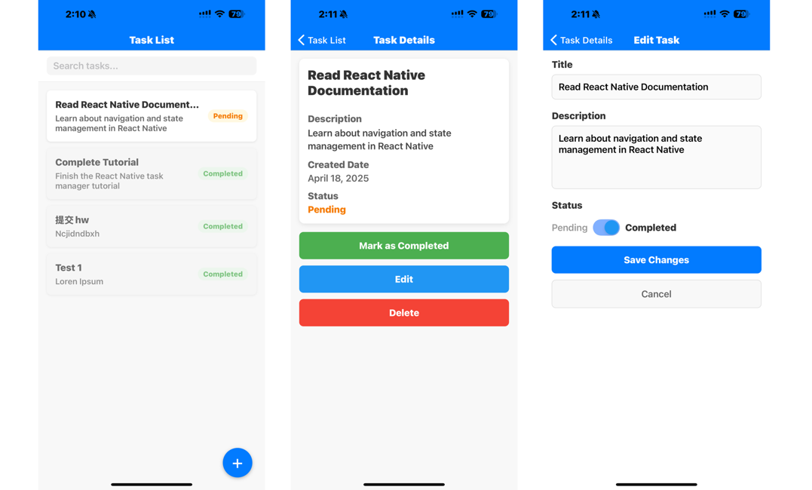
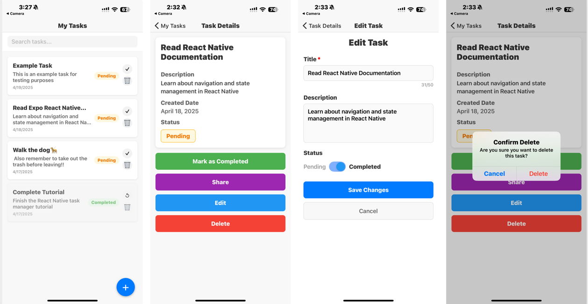

# Personal Task Manager App

A simple React Native mobile application built with Expo and TypeScript that functions as a personal task manager. This app allows users to create, view, edit, and delete tasks, as well as mark tasks as completed or pending.

## Features

- **Task List**: Display a list of tasks with title, description, and status
- **Add Tasks**: Create new tasks with title, description, and status
- **Edit Tasks**: Modify existing task details
- **Delete Tasks**: Remove tasks from the list
- **Toggle Status**: Mark tasks as completed or pending
- **Task Details**: View detailed information about a task
- **Search Functionality**: Filter tasks by title or description

## Screenshots

#### Version 1:

This version is the original version base on the instruction guideline,already met all the requirement

#### version 2:
Based on several user testing I conducted, I made several improvements according to the feedback:
1.	**Task List Enhancements**:
To reduce the number of clicks required, I added two visible shortcut icons: a checkmark (✔) for completion and 
a trash bin 🗑 for deletion. Previously, users had to click multiple times to take action; now, they can make decisions with a single tap.
2.	**Task Details Form**:
For consistency, I replaced the plain text status indicator with a toggle switch to manage the “Pending” status—matching the component used in the edit form. Additionally, I introduced a “Share” button to accommodate potential future functionality.
A more distinct color scheme was applied to minimize users’ memory load by keeping key actions and options visible and easily accessible when needed.
3.	**Error Prevention**:
Previously, clicking the “Delete” button would immediately remove the task without warning. To prevent accidental deletions, I added a confirmation message that prompts the user to confirm the action before proceeding.


## Project Structure

```
task-manager/
├── App.tsx                  # Main application component
├── src/
│   ├── components/          # Reusable UI components
│   │   ├── TaskItem.tsx     # Component for displaying a task item
│   ├── screens/             # Application screens
│   │   ├── HomeScreen.tsx   # Main task list screen
│   │   ├── TaskDetailScreen.tsx # Task details view
│   │   ├── TaskFormScreen.tsx   # Form for creating/editing tasks
│   ├── types/               # TypeScript type definitions
│   │   ├── index.ts         # Shared types across the app
│   ├── data/                # Mock data and data utilities
│   │   ├── mockTasks.ts     # Initial mock tasks for testing
```

## Technologies Used

- **React Native**: Framework for building native mobile apps
- **Expo**: Platform for building and deploying React Native applications
- **TypeScript**: Adds static typing to JavaScript to improve development experience
- **React Navigation**: Library for routing and navigation in React Native
- **Hooks API**: Used for state management (useState, useEffect)

## Prerequisites

Before you begin, ensure you have the following installed:
- [Node.js](https://nodejs.org/) (version 12 or later)
- [npm](https://www.npmjs.com/) or [Yarn](https://yarnpkg.com/)
- [Expo CLI](https://docs.expo.dev/get-started/installation/)
- [Android Studio](https://developer.android.com/studio) (for Android development)
- [Xcode](https://developer.apple.com/xcode/) (for iOS development, macOS only)

## Getting Started

Follow these steps to set up and run the app on your local machine:

### 1. Clone the repository

```bash
git clone https://github.com/your-username/personal-task-manager.git
cd personal-task-manager
```

### 2. Install dependencies

```bash
npm install
# or
yarn install
```

### 3. Start the development server

```bash
npx expo start
# or
yarn expo start
```

### 4. Run on a device or simulator

- Press `a` to run on an Android emulator
- Press `i` to run on an iOS simulator (macOS only)
- Scan the QR code with the Expo Go app on your physical device

## Usage

### Creating a Task
1. Tap the "+" button on the home screen
2. Fill in the task title (required) and description (optional)
3. Select the status (pending or completed)
4. Tap "Create Task"

### Viewing Task Details
- Tap on any task in the list to view its details

### Editing a Task
1. Navigate to the task details screen
2. Tap "Edit"
3. Modify the task information
4. Tap "Save Changes"

### Deleting a Task
1. Navigate to the task details screen
2. Tap "Delete"
3. Confirm deletion in the prompt

### Searching Tasks
- Use the search bar at the top of the home screen to filter tasks by title or description


## Future Improvements

- Add data persistence using AsyncStorage
- Implement categories or tags for tasks
- Add due dates and reminders
- Implement drag-and-drop reordering of tasks
- Add user authentication

## License

This project is licensed under the MIT License - see the [LICENSE](LICENSE) file for details.

## Author

Jieyao Chen